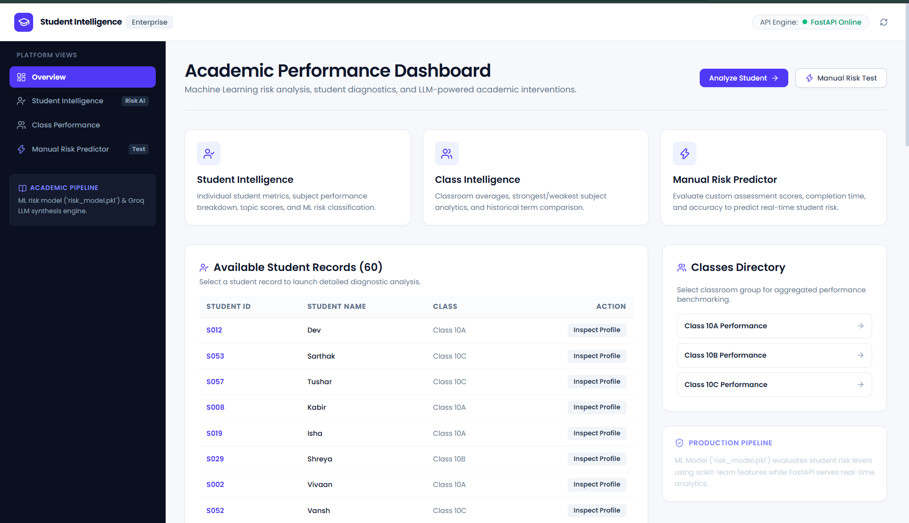

# 🎓 Student Performance Intelligence

An AI-powered academic performance analysis and risk prediction platform. Combines **Machine Learning risk assessment**, **data analytics**, and **Groq LLM-synthesized insights** with a **modern React frontend** and a high-performance **FastAPI backend**.

<p align="center">
  
</p>

---

## ✨ Features

- 👤 **Student Intelligence**: Comprehensive student profiles, overall score & accuracy metrics, topic breakdown, trend indicators, ML risk level classification, and AI academic advice.
- 🏫 **Class Intelligence**: Aggregated classroom averages, student enrollment tracking, strongest vs. weakest subject distributions, historical term comparison, and AI class pedagogical insights.
- ⚡ **Manual Risk Predictor**: Interactive testing interface for custom assessment scores, completion times, and accuracy metrics with real-time risk classification.
- 🤖 **Groq LLM & Fallback Engine**: Natural language performance summaries and actionable recommendations with automated offline rule-synthesis fallback.
- 🎨 **Enterprise SaaS Design**: Minimal Linear/Vercel-inspired UI built with React 19, Tailwind CSS v4, Lucide icons, Recharts visualizations, and Gilroy & Poppins typography.

---

## 🏗️ Architecture

```text
┌─────────────────────────────────────────────────────────┐
│              React 19 Frontend (Vite)                   │
│         Dashboard • Student • Class • Manual            │
└───────────────────────────┬─────────────────────────────┘
                            │ REST API (JSON)
                            ▼
┌─────────────────────────────────────────────────────────┐
│                 FastAPI Backend                         │
│            CORS • Analytics • Services                  │
└───────────────┬─────────────────────────┬───────────────┘
                │                         │
                ▼                         ▼
┌───────────────────────────────┐ ┌───────────────────────┐
│ Machine Learning (Joblib/Sklearn)│ │ Groq LLM Insight Engine│
│       `risk_model.pkl`        │ │   (Llama / Fallback)  │
└───────────────────────────────┘ └───────────────────────┘
```

---

## 🛠️ Tech Stack

### Frontend (`/client`)
- **Framework**: React 19 + Vite 8
- **Styling**: Tailwind CSS v4 + Custom Glassmorphic Utilities
- **Charts**: Recharts
- **Icons**: Lucide React
- **Typography**: Gilroy & Poppins

### Backend (`/server`)
- **API Framework**: FastAPI + Uvicorn
- **Data Analytics**: Pandas + NumPy
- **Machine Learning**: Scikit-Learn (Logistic Regression, Random Forest, Decision Tree, SVM) + Joblib
- **AI & LLM Integration**: Groq API (Llama models)

---

## 📁 Repository Structure

```text
student-performance-intelligence/
├── client/                      # React 19 + Vite Frontend
│   ├── src/
│   │   ├── components/          # Navbar, Sidebar, Overview, StudentAnalysis, ClassAnalysis, ManualPrediction, AIInsightCard
│   │   ├── services/            # API client layer (Fetch / CORS)
│   │   ├── types/               # TypeScript interfaces
│   │   ├── App.tsx              # Main layout & router container
│   │   └── index.css            # Tailwind & custom design tokens
│   ├── package.json
│   └── vite.config.ts
│
├── server/                      # FastAPI Backend
│   ├── api/
│   │   └── main.py              # FastAPI endpoints & CORS middleware
│   ├── analytics/               # Student, class, and trend data processing
│   ├── ml/                      # Scikit-Learn risk prediction model & features
│   │   └── risk_model.pkl
│   ├── llm/                     # Groq LLM insight generator & fallbacks
│   ├── services/                # Business logic services
│   ├── data/
│   │   └── raw_data.csv         # Assessment data
│   └── requirements.txt
│
├── .gitignore
└── README.md
```

---

## 🚀 Quick Start Guide

### Prerequisites
- **Python**: `3.10` or higher
- **Node.js**: `18.0` or higher (with `npm`)

---

### 1. Setting Up the Backend (`server/`)

1. Navigate to the `server/` directory:
   ```bash
   cd server
   ```

2. Create a virtual environment:
   ```bash
   python -m venv venv
   ```

3. Activate the virtual environment:
   - **Windows (PowerShell)**:
     ```powershell
     .\venv\Scripts\Activate.ps1
     ```
   - **Windows (Command Prompt)**:
     ```cmd
     venv\Scripts\activate.bat
     ```
   - **macOS / Linux**:
     ```bash
     source venv/bin/activate
     ```

4. Install Python dependencies:
   ```bash
   pip install -r requirements.txt
   ```

5. *(Optional)* Configure Environment Variables for Groq LLM:
   Create a `.env` file in `server/`:
   ```env
   GROQ_API_KEY=your_groq_api_key_here
   ```
   *Note: If no Groq API key is supplied, the server automatically uses rule-based fallback generators, ensuring full offline functionality.*

6. Start the FastAPI server:
   ```bash
   python -m uvicorn api.main:app --reload --port 8000
   ```
   - API Server: `http://127.0.0.1:8000`
   - Interactive Swagger Docs: `http://127.0.0.1:8000/docs`

---

### 2. Setting Up the Frontend (`client/`)

1. Open a new terminal and navigate to `client/`:
   ```bash
   cd client
   ```

2. Install Node dependencies:
   ```bash
   npm install
   ```

3. Launch the Vite development server:
   ```bash
   npm run dev
   ```

4. Open `http://localhost:5173` in your browser.

---

## 🔌 API Endpoints Reference

| Method | Endpoint | Description |
| :--- | :--- | :--- |
| `GET` | `/` | Health check status |
| `GET` | `/students` | List of available student records for autocomplete |
| `GET` | `/classes` | List of unique class IDs |
| `GET` | `/student/{student_id}` | Detailed student profile, score, accuracy, risk probability, and AI insights |
| `GET` | `/class/{class_id}` | Class average, student count, term trend comparison, and AI insights |
| `POST` | `/manual-prediction` | Calculate real-time risk classification for custom assessment inputs |

---

## 📄 License

Distributed under the MIT License. See `LICENSE` for details.
